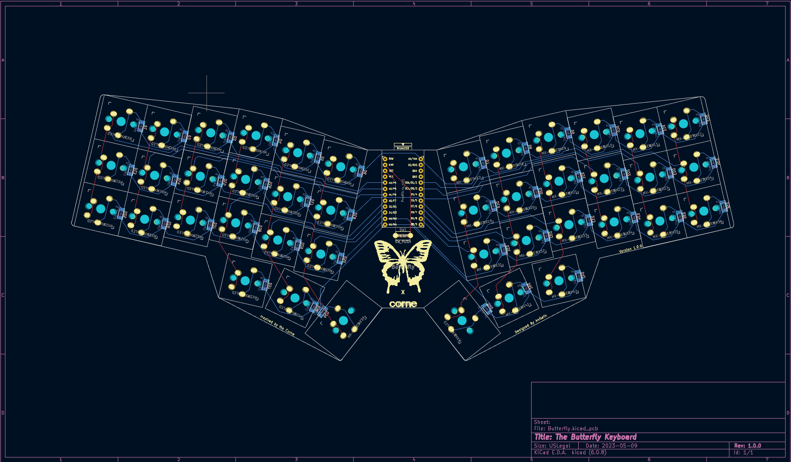
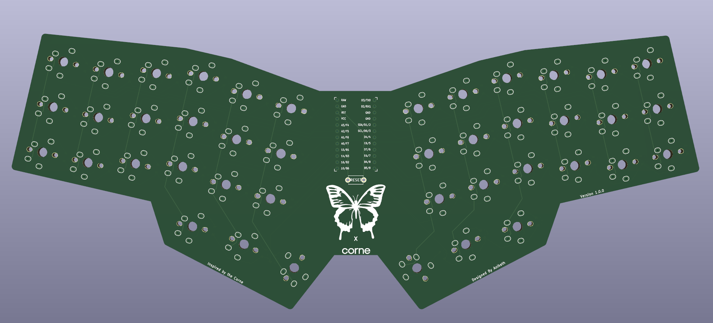
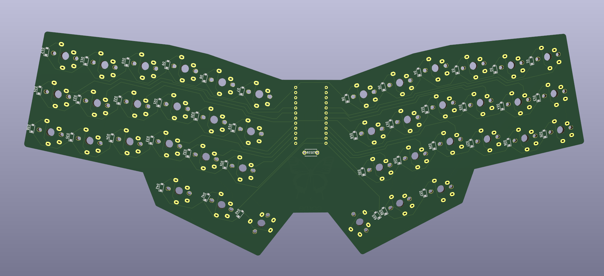

# The Butterfly Keyboard

## Origin

I started this project for a few reasons:

1. I've wanted to try designing my own pcb
2. I like the layout of the [corne](https://github.com/foostan/crkbd) keybord 
3. I wanted a lightweight and relatively small keyboard to bring around with me

## Design

As mentioned before I took a lot of inspration from the very popular  [corne](https://github.com/foostan/crkbd) designed by foostan.  Most of the layout was taken directly from the corne, however a few key changes were made to fit my constraints. They are as follows: 

1. The board is a singular piece which allows for the use of one microcontroller
2. Each "half" of the board is angled in at 13 degrees for a more comfortable typing position
3. The switch footprints are a solder only mx/choc hybrid (taken from foostan's [keyboard](https://github.com/foostan/kbd) library)

The intended use I had for this board was to simply use the pcb as the entire board. I wanted to keep the board as thin and small as possible. A foam pad should cover the bottom of the board to protect it from damage.    
The name came about as I was outlining the pcb for the board. The shape heavily reminded me of a butterfly and I decided to name the board as such!

## Pictures

### PCB Design

### 3D Render of the Front

### 3D Render of the Back

